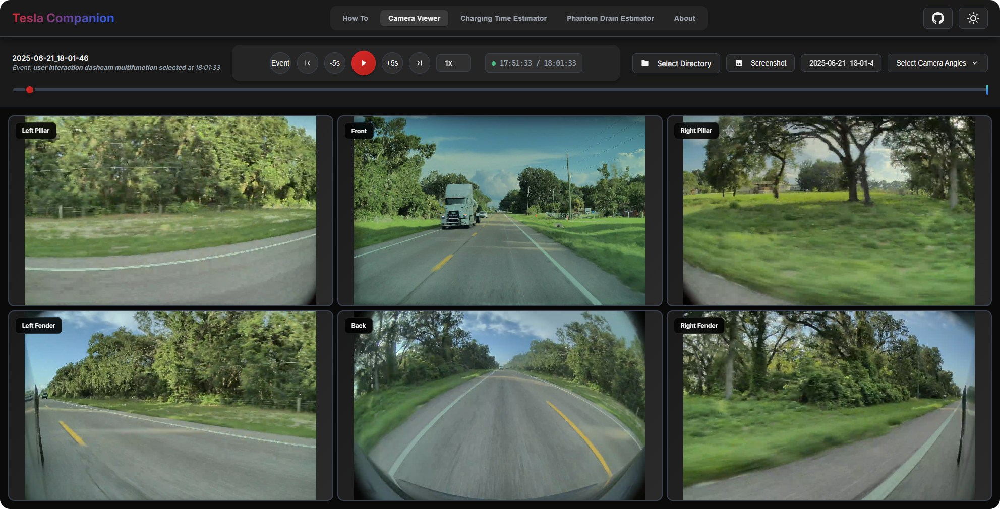
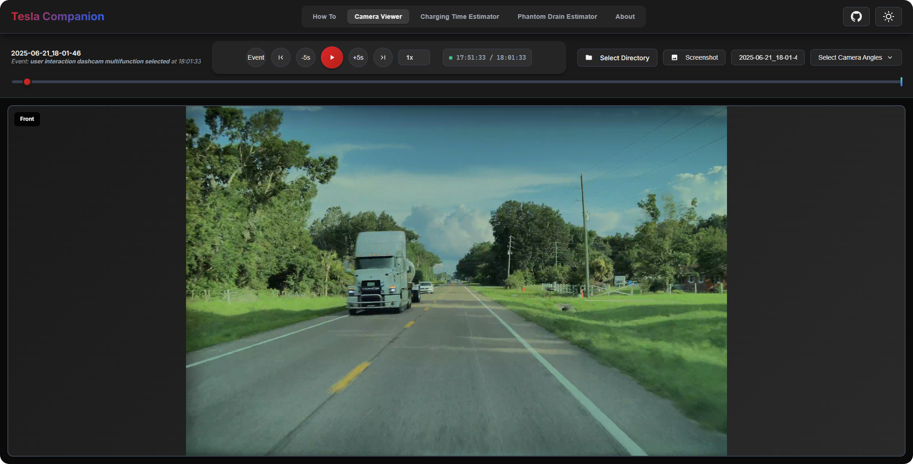
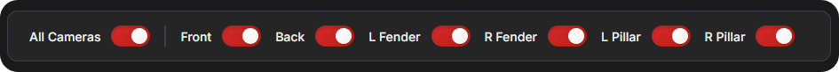
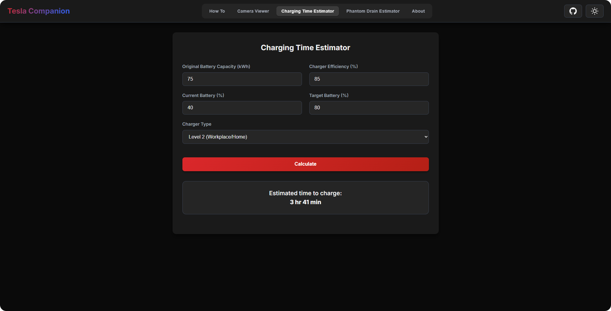
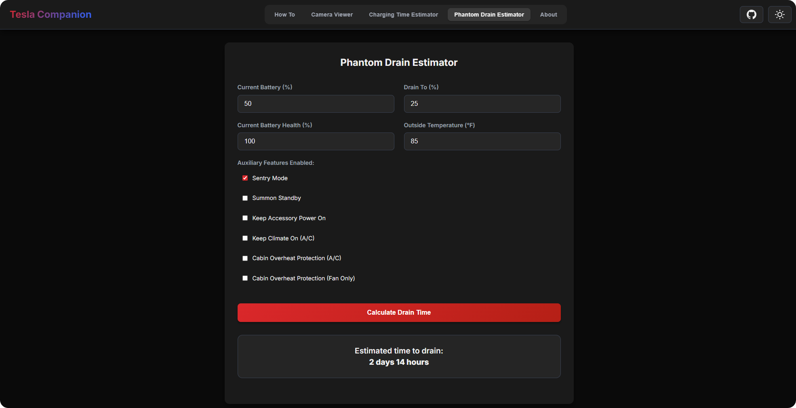

# Tesla Companion

**Your all-in-one, web-based toolkit for viewing TeslaCam clips, estimating charging time, calculating phantom drain, and more.**  
This app is a single, self-contained HTML file that runs entirely in your browser for maximum privacy and portability.

## ✨ Features

- **Multi-Camera Viewer**: Simultaneously view clips from all available cameras (Front, Back, Left/Right Repeaters, Left/Right Pillars) in a synchronized grid.
- **Seamless Event Playback**: Automatically groups 1-minute video files into a single, continuous event timeline and plays them back seamlessly without manual intervention.
- **Interactive Playback Controls**: Full playback controls including play/pause, a master scrubber, 5-second skips, and variable playback speed (0.25x to 4x).
- **Single-View Zoom**: Double-click any camera feed to expand it to full view. Double-click again to return to the grid layout.
- **Camera Toggling**: Customize your view by toggling individual camera feeds on or off.
- **Jump to Event**: If a Sentry or Dashcam event is detected, a button appears to jump directly to the moment of the trigger within the timeline.
- **In-App Map Viewer**: If an event contains GPS data, click the "Event Map" button to see the location on an embedded Google Map without leaving the page.
- **Enhanced Screenshots**: Capture a high-quality composite image of all visible camera feeds with a single click.
- **Charging Time Estimator**: Calculate how long a charging session will take based on your vehicle's battery capacity, current/target State of Charge (SoC), and charger type (including custom inputs).
- **Phantom Drain Estimator**:
  - *Time to Drain*: Estimate how long your battery will last while parked by setting a target drain percentage.
  - *Percentage Lost*: Calculate the expected battery percentage loss over a specific date and time range.
  - *Refined Calculations*: Both drain modes can be refined with inputs for battery health, outside temperature, and active auxiliary features (Sentry Mode, Summon Standby, etc.).
- **Light & Dark Modes**: A sleek, modern interface with automatic theme detection and manual toggling.
- **Fully Responsive & Keyboard Accessible**: Works beautifully on desktop, tablet, and mobile browsers, with full keyboard shortcuts for core playback functions.
- **Privacy Focused**: No data ever leaves your computer. All file processing and calculations happen locally in your browser.

## 🚀 Live Demo

Try a live version of Tesla Companion hosted on GitHub Pages:  
👉 [https://jleshnick.github.io/TeslaCompanion/](https://jleshnick.github.io/TeslaCompanion/)

## 💻 How to Use

1. **Get Your Clips**: Plug your Tesla's USB drive into your computer.
2. **Launch the App**: Open the `index.html` file in a modern web browser (Chrome, Firefox, Edge recommended).
3. **Load Clips**:
   - Navigate to the **Camera Viewer** tab.
   - Click the **"Select Directory"** button.
   - Choose the main `TeslaCam` folder from your drive. The app will automatically find and sort all event folders.
4. **View Events**: Use the event dropdown menu or the previous/next navigation buttons to switch between recordings.

## ⌨️ Keyboard Shortcuts

| Key            | Action                                 |
|----------------|----------------------------------------|
| Spacebar       | Play / Pause                           |
| Left Arrow     | Rewind 5 seconds                       |
| Right Arrow    | Forward 5 seconds                      |
| Up Arrow       | Go to the previous event               |
| Down Arrow     | Go to the next event                   |
| Escape         | Exit fullscreen view or close the map  |

## 📚 Reference

### Camera Indexes

The `event.json` file references cameras by a number. Mapping:

| Index | Camera View      |
|-------|------------------|
| 0     | Front            |
| 3     | Left Pillar      |
| 4     | Right Pillar     |
| 5     | Left Repeater    |
| 6     | Right Repeater   |
| 7     | Back             |

### Event Reasons

The `reason` field in the event file indicates what triggered the recording:

| Reason Code                         | Description                                                 |
|------------------------------------|-------------------------------------------------------------|
| `sentry_aware_object_detection`    | Sentry Mode detected an object or movement nearby.          |
| `user_interaction_dashcam_icon_tapped` | Manual Dashcam recording triggered via icon.          |
| `sentry_locked_handle_pulled`      | Door handle pulled while the car was locked (Sentry Mode).  |
| `user_interaction_honk`            | Manual Dashcam recording triggered by honking the horn.     |

## 🛠️ Technologies Used

- **HTML5** – Core structure
- **CSS3** – Modern styling with theming support via custom properties
- **Vanilla JavaScript (ES6+)** – Logic, video handling, and DOM manipulation
- **Google Fonts** – For the *Inter* typeface
- **Feather Icons** – For simple, clean UI icons

## 🖼️ Gallery

- 📷 **Camera Viewer**

**Full Camera Grid**  

**Expanded Single-Camera View**  

**Camera Angle Selector**  

### 🔌 Tools

**Charging Time Estimator**  

**Phantom Drain Estimator**  

## 🙏 Acknowledgements

- Core camera viewer functionality based on **Lythinari's TeslaCamViewer**.
- Enhanced UI, additional tools, and numerous refinements by **Joshua Leshnick**.

## 📄 License

This project is licensed under the **MIT License**.  
See the [LICENSE](LICENSE) file for full details.
